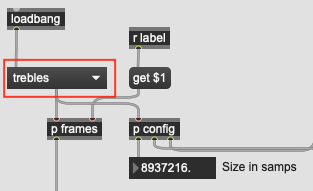

# Music Computing Final Project
This project attempts to implement language modelling for concatenative audio synthesis using RNNs (GRU).

For more information, refer to the [Wiki](https://github.com/wwerkk/MC-FP/wiki).

## Quick start
After cloning this repo, you will have to install requirements:
``
pip install -r requirements.txt
``
### Max MSP
For real-time generation and synthesis with any model:
1. run ``python generate.py -p /Users/You/MC-FP/models/modelname``
2. open ``synth.maxproj``
3. pick the correct model using the drop down menu in top left corner
4. turn on audio and press space to start predictions and playback
5. twiddle with some parameters
### Other
Although the demo is implemented in Max MSP, models trained using this code can be used in any audio software environment, as long as it supports JSON format and can communicate via [OSC](https://opensoundcontrol.stanford.edu/index.html).
## Training your own model
You can train your own model using the notebook provided: [Training.ipynb](Training.ipynb).

After that it's ready to use, but to use it with Max, you will have to add the necessary files from the model folder to the Max project so their location is known to the patch. There are two ways to do this:
- dragging the *model* and *audio-data* folders into the Max project explorer
- doing so with individual files, the source audio file the model was trained on and the .json files generated in /models/modelname

You will also have to add the model name to the items attribute of the ``umenu`` object in the left corner of the patch.
To do so, you can do the following:
1. locate the ``umenu`` object in the patch, it's a drop-down menu in the top left corner and it looks like this

2. unlock the patch by pressing CMD+E (or CTRL+E on Windows)
3. click on the ``umenu`` object, it should be now highlighted
4. press CMD+I (or CTRL+I on Windows) to open the object inspector, it should pop out on the right side of the window
5. under ``Items`` header, find the ``Menu Items`` attribute and add the name of your model to the list, separated by a comma
6. click anywhere on the patch and lock it by pressing CMD+E (or CTRL+E on Windows) again
7. well done, now you can choose your model from the drop-down menu and use it in the patch!